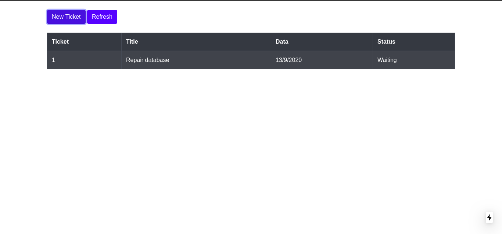
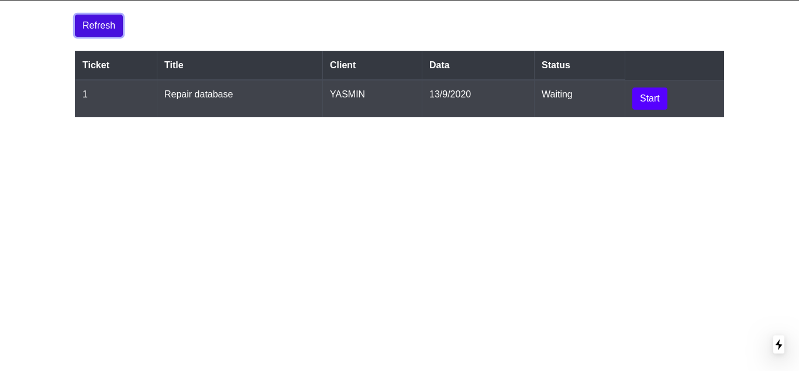

<h1 align=center>TicketManager</h1>
<h4 align=center>Fullstack APP</h4>
<h5 align=center>Index screen</h5>

<h5 align=center>User screen</h5>

<h5 align=center>Suport screen</h5>

<h5>Libries Backend:</h5>
<a href="https://www.prisma.io/">Prisma</a> | <a href="https://www.typescriptlang.org/">Typescript</a> | <a href="https://jwt.io/">JWT</a> | <a href="https://www.npmjs.com/package/bcrypt">Bcrypt</a> | <a href="https://expressjs.com/pt-br/">Express</a> | <a href="https://eslint.org/">Eslint</a> | <a href="https://www.npmjs.com/package/ts-node-dev">Ts-node-dev</a>
<br>

<h5>Libries Frontend:</h5>

<a href="https://nextjs.org/">Nextjs</a> | <a href="https://reactjs.org/">React</a> | <a href="https://react-bootstrap.github.io/">React-bootstrap</a> | <a href="https://getbootstrap.com/">Bootstrap</a>
<br>
Images obtained at: <a href="https://undraw.co/">Undraw</a>

<br><br>

<h4 align=center>Getting started</h4>

<h5>Requirements:</h5>
<a href="https://nodejs.org/en/">Nodejs</a>, <a href="https://www.docker.com/">Docker</a>

<br><br>

<h5>Create .env file</h5>
Create .env file for good functioning.<br><br>
Backend Environment Variables:<br>
JWT_KEY<br>
ADM_EMAIL<br>
ADM_PASSWORD<br>

<br><br>
Frontend Environment Variables:<br>
ADM_EMAIL<br>
ADM_PASSWORD<br>

<br>

<h5>Install dependencies</h5>

```bash
#For YARN
yarn

#For NPM
npm install
```

<h5>Running Project</h5>

```bash
#Running backend
cd backend
yarn dev
docker-compose up
#Running frontend
cd frontend && yarn dev
```

Now <a href="http://localhost:3000">access localhost:3000 or click here</a>
